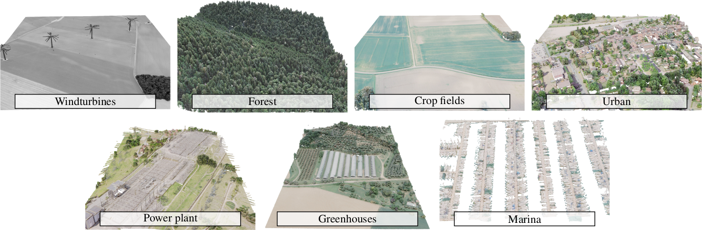

<div align="center">

# Earth Parser Dataset Toolbox

</div>

This repository contains helper scripts to open, visualize, and process point clouds from the Earth Parser dataset.



## Usage 

- **Download** 

The dataset can be downloaded from [zenodo](https://zenodo.org/record/7820686)

- **Data loading** 

This repository contains: 

```markdown
📦EarthParserDataset
 ┣ 📂configs                # hydra config files
 ┣ 📂earthparserdataset     # PytorchLightning datamodules
 ┣ 📂notebooks              # some illustrative notebooks
 ```

- **Visualization and Usage** 

See our notebooks in `/notebooks` for examples of data manipulation and several visualization functions.

## Citation   

If you use this dataset and/or this API in your work, please cite our [paper](https://imagine.enpc.fr/~loiseaur/learnable-earth-parser).

```markdown
@misc{loiseau2023learnable,
      title={Learnable Earth Parser: Discovering 3D Prototypes in Aerial Scans}, 
      author={Romain Loiseau and Elliot Vincent and Mathieu Aubry and Loic Landrieu},
      year={2023},
      eprint={2304.09704},
      archivePrefix={arXiv},
      primaryClass={cs.CV}
}
```